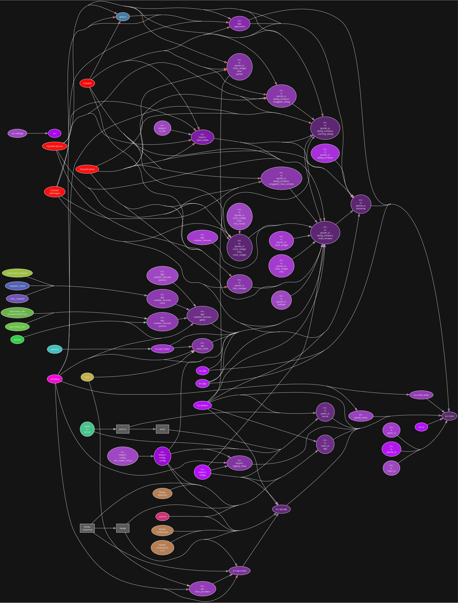
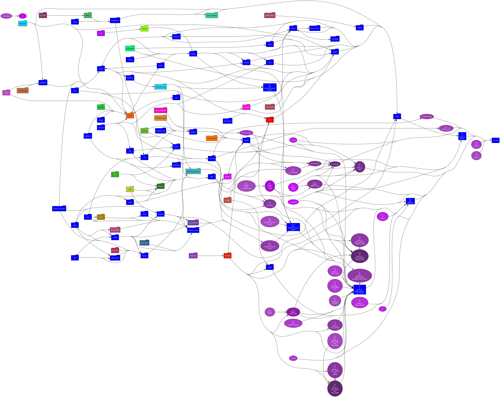

# Python Standalone GUI template

### Executable files do download for Windows and Linux

<table>
  <tr>
    <th style="text-align: center;">Windows (click on image):</th>
    <th style="width: 100px;"></th>
    <th style="text-align: center;">Linux (click on image):</th>
  </tr>
  <tr>
    <td align="center">
      <a href="https://github.com/DariuszMak/python-standalone-gui-template/releases/download/0.18.0/GUI_client.exe">
        
      </a>
    </td>
    <td></td>
    <td align="center">
      <a href="https://github.com/DariuszMak/python-standalone-gui-template/releases/download/0.18.0/GUI_client">
        
      </a>
    </td>
  </tr>
</table>

### Project structure diagrams

##### Modular perspective

<p align="center">
  
</p>

##### Library dependencies perspective

<p align="center">
  
</p>

## Requirements

- [UV](https://github.com/astral-sh/uv) package manager
- [Docker Desktop](https://www.docker.com/products/docker-desktop)

## Local development (Windows PowerShell)

You can also use VSCode `settings.json` and `launch.json` files to run the project (choose interpreter created by UV).

Login in SonarQube as `admin` with password `Admin1@Admin1@`.

## Fast native Windows development

```commandline
deactivate ; 
clear ; 

docker system df ; 
docker stop $(docker ps -a -q) ; 
docker rm -f $(docker ps -a -q) ; 
docker system prune --volumes -a -f ; 
docker volume rm -f $(docker volume ls -q) ; 
docker system df ; 

$ports = 8000, 8001, 8002, 8003, 8004, 8005, 9000

foreach ($port in $ports) {
    $conns = Get-NetTCPConnection -LocalPort $port -ErrorAction SilentlyContinue
    if ($conns) {
        $conns | Select-Object -ExpandProperty OwningProcess -Unique |
            Where-Object { $_ -gt 0 } |
            ForEach-Object {
                Write-Host "Port $port is used by PID $_. Killing..."
                Stop-Process -Id $_ -Force -ErrorAction SilentlyContinue
            }
    } else {
        Write-Host "No process is using port $port."
    }
}

uv self update ; 
uv cache clean ; 

git reset --hard HEAD ; 
git clean -x -d -f ; 

uv python install 3.11 ; 
uv python pin 3.11 ; 
uv sync --dev --no-cache ; 
uv lock ; 

########## STATIC ANALYSIS & TESTS

.venv\Scripts\Activate.ps1 ; 
$env:UV_ENV_FILE = ".dev.env" ; 

uv run python src\pyside_setup.py ; 
uv run python src\node_setup.py ; 

.\scripts\format_and_lint.ps1 ; 
.\src\ui\react_ui\frontend\frontend_format_and_lint.ps1 ; 

.\src\ui\react_ui\frontend\frontend_test.ps1 ; 
uv run pytest tests/ --cov=src --cov-report=html --cov-report=xml --cov-config=.coveragerc -vv ; 

Start-Process src\ui\react_ui\frontend\coverage\index.html ; 
Start-Process .\htmlcov\index.html ; 

########## RUN APPLICATION LOCALLY

Start-Process uv -ArgumentList "run", "python", "src\main.py" ; 
Start-Sleep -Seconds 20 ; 
Start-Process "http://127.0.0.1:8000/openapi.json" ; 
Start-Process "http://127.0.0.1:8000/redoc" ; 
Start-Process "http://127.0.0.1:8000/docs" ; 
Start-Process "http://127.0.0.1:8001" ; 
Start-Process "http://127.0.0.1:8002" ; 

newman run collections\Python_GUI_API.postman_collection.json --environment collections\environments_API\API_Windows.postman_environment.json ; 
newman run collections\Python_GUI_UI.postman_collection.json --environment collections\environments_UI\Panel_UI_Dev_Windows.postman_environment.json ; 
newman run collections\Python_GUI_UI.postman_collection.json --environment collections\environments_UI\React_UI_Dev_Windows.postman_environment.json ; 
```

## Full code analysis

```commandline
deactivate ; 
clear ; 

docker system df ; 
docker stop $(docker ps -a -q) ; 
docker rm -f $(docker ps -a -q) ; 
docker system prune --volumes -a -f ; 
docker volume rm -f $(docker volume ls -q) ; 
docker system df ; 

$ports = 8000, 8001, 8002, 8003, 8004, 8005, 9000

foreach ($port in $ports) {
    $conns = Get-NetTCPConnection -LocalPort $port -ErrorAction SilentlyContinue
    if ($conns) {
        $conns | Select-Object -ExpandProperty OwningProcess -Unique |
            Where-Object { $_ -gt 0 } |
            ForEach-Object {
                Write-Host "Port $port is used by PID $_. Killing..."
                Stop-Process -Id $_ -Force -ErrorAction SilentlyContinue
            }
    } else {
        Write-Host "No process is using port $port."
    }
}

uv self update ; 
uv cache clean ; 

git reset --hard HEAD ; 
git clean -x -d -f ; 

uv python install 3.11 ; 
uv python pin 3.11 ; 
uv sync --dev --no-cache ; 
uv lock ; 

########## STATIC ANALYSIS & TESTS

.venv\Scripts\Activate.ps1 ; 
$env:UV_ENV_FILE = ".dev.env" ; 

uv run python src\pyside_setup.py ; 
uv run python src\node_setup.py ; 

.\scripts\format_and_lint.ps1 ; 
.\src\ui\react_ui\frontend\frontend_format_and_lint.ps1 ; 

.\src\ui\react_ui\frontend\frontend_test.ps1 ; 
uv run pytest tests/ --cov=src --cov-report=html --cov-report=xml --cov-config=.coveragerc -vv ; 

Start-Process src\ui\react_ui\frontend\coverage\index.html ; 
Start-Process .\htmlcov\index.html ; 

########## SONARQUBE

# Start SonarQube + DB
docker compose up -d sonarqube sonardb

Write-Host "Waiting for SonarQube to start..."

# Wait until SonarQube API responds
do {
    Start-Sleep -Seconds 5

    try {
        $status = Invoke-RestMethod `
            -Uri "http://127.0.0.1:9000/api/system/status" `
            -Method Get
    }
    catch {
        $status = $null
    }

} until ($status.status -eq "UP")

Write-Host "SonarQube is UP"

# Default credentials
$oldPassword = "admin"
$newPassword = "Admin1@Admin1@"

$pair = "admin:$oldPassword"
$encoded = [Convert]::ToBase64String(
    [Text.Encoding]::ASCII.GetBytes($pair)
)

$headers = @{
    Authorization = "Basic $encoded"
}

# Change admin password
Invoke-RestMethod `
    -Uri "http://127.0.0.1:9000/api/users/change_password" `
    -Method Post `
    -Headers $headers `
    -Body @{
        login = "admin"
        previousPassword = $oldPassword
        password = $newPassword
    }

Write-Host "Password changed"

# Authenticate with new password
$newPair = "admin:$newPassword"
$newEncoded = [Convert]::ToBase64String(
    [Text.Encoding]::ASCII.GetBytes($newPair)
)

$newHeaders = @{
    Authorization = "Basic $newEncoded"
}

# Generate token
$tokenName = "global-analysis-token"

$tokenResponse = Invoke-RestMethod `
    -Uri "http://127.0.0.1:9000/api/user_tokens/generate" `
    -Method Post `
    -Headers $newHeaders `
    -Body @{
        name = $tokenName
        type = "GLOBAL_ANALYSIS_TOKEN"
    }

$token = $tokenResponse.token

Write-Host "Generated token:"
Write-Host $token

# Create .sonar.env dynamically
@"
SONAR_HOST_URL=http://host.docker.internal:9000
SONAR_TOKEN=$token
"@ | Out-File -Encoding utf8 ".sonar.env"

# Run scanner
$scannerOutput = docker run --rm `
    --network python-standalone-gui-template_default `
    --env-file .sonar.env `
    -v "${PWD}:/usr/src" `
    sonarsource/sonar-scanner-cli 2>&1
$scannerOutput

$reportUrls = ($scannerOutput |
    Select-String "http://\S+") |
    ForEach-Object { $_.Matches.Value }

foreach ($url in $reportUrls) {
    Write-Host "Opening:"
    Write-Host $url
    Start-Process $url
}

########## UPDATE DIAGRAMS

uv run pydeps src\main.py --noshow -T svg -o images\structure_runner_clustered.svg --max-bacon 100 --max-module-depth 100 --rankdir LR --cluster ; 
uv run pydeps src\main.py --noshow -T svg -o images\structure_runner.svg --max-bacon 2 --max-module-depth 100 --rankdir LR ; 
uv run pydeps src\main.py --noshow -T svg -o images\structure_runner_pylib.svg --max-bacon 2 --max-module-depth 100 --rankdir LR --pylib ; 

uv run pydeps src --noshow -T svg -o images\structure_module_clustered.svg --max-bacon 100 --max-module-depth 100 --rankdir LR --cluster ; 
uv run pydeps src --noshow -T svg -o images\structure_module.svg --max-bacon 2 --max-module-depth 100 --rankdir LR ; 
uv run pydeps src --noshow -T svg -o images\structure_module_pylib.svg --max-bacon 2 --max-module-depth 100 --rankdir LR --pylib ; 

uv run pydeps tests --noshow -T svg -o images\structure_tests_module_clustered.svg --max-bacon 100 --max-module-depth 100 --rankdir LR --cluster ; 
uv run pydeps tests --noshow -T svg -o images\structure_tests_module.svg --max-bacon 2 --max-module-depth 100 --rankdir LR ; 
uv run pydeps tests --noshow -T svg -o images\structure_tests_module_pylib.svg --max-bacon 2 --max-module-depth 100 --rankdir LR --pylib ; 

$files = Get-ChildItem "images" -Filter "*.svg"

foreach ($file in $files) {
    $svg = Get-Content $file.FullName -Raw
    $svg = $svg -replace '<polygon fill="white"', '<polygon fill="#141414"'
    $svg = $svg -replace '<svg', '<svg style="background-color:#141414"'
    $svg = $svg -replace 'fill="blue"', 'fill="#5a5a5a"'
    $svg = $svg -replace 'fill="#ffffff"', 'fill="#2e2e2e"'
    $svg = $svg -replace 'stroke="black"', 'stroke="#ffffff"'
    $svg = $svg -replace 'stroke="#000000"', 'stroke="#5f5f5f"'
    $svg = $svg -replace '<text([^>]*)fill="[^"]+"', '<text$1fill="#e0e0e0"'
    $svg = $svg -replace '<g class="cluster">', '<g class="cluster" style="opacity:0.85"'

    Set-Content -Path $file.FullName -Value $svg -Encoding UTF8
    Write-Host "Structure preserved: $($file.Name)"
}

Start-Process images\structure_module.svg ; 
Start-Process images\structure_module_clustered.svg ; 
```

## Thorough setup from scratch for Windows and Linux enviroment

```commandline
deactivate ; 
clear ; 

docker system df ; 
docker stop $(docker ps -a -q) ; 
docker rm -f $(docker ps -a -q) ; 
docker system prune --volumes -a -f ; 
docker volume rm -f $(docker volume ls -q) ; 
docker system df ; 

$ports = 8000, 8001, 8002, 8003, 8004, 8005, 9000

foreach ($port in $ports) {
    $conns = Get-NetTCPConnection -LocalPort $port -ErrorAction SilentlyContinue
    if ($conns) {
        $conns | Select-Object -ExpandProperty OwningProcess -Unique |
            Where-Object { $_ -gt 0 } |
            ForEach-Object {
                Write-Host "Port $port is used by PID $_. Killing..."
                Stop-Process -Id $_ -Force -ErrorAction SilentlyContinue
            }
    } else {
        Write-Host "No process is using port $port."
    }
}

uv self update ; 
uv cache clean ; 

git reset --hard HEAD ; 
git clean -x -d -f ; 

docker-compose run --build app ; 

uv python install 3.11 ; 
uv python pin 3.11 ; 
uv sync --dev --no-cache --locked ; 

.venv\Scripts\Activate.ps1 ; 
$env:UV_ENV_FILE = ".dev.env" ; 

.\scripts\format_and_lint.ps1 ; 
.\src\ui\react_ui\frontend\frontend_format_and_lint.ps1 ; 

docker-compose run app sh -c "dos2unix thorough.env src/ui/react_ui/frontend/frontend_test.sh" ; 
docker-compose run app sh -c "cd src/ui/react_ui/frontend && rm -rf node_modules package-lock.json && npm install && cd /app && uv sync --dev --locked --no-cache && chmod +x src/ui/react_ui/frontend/frontend_test.sh && src/ui/react_ui/frontend/frontend_test.sh && uv run pytest tests/ --cov=src"
docker-compose run --rm --remove-orphans app sh -c "uv sync --dev --locked --no-cache && uv run pyinstaller --clean ./scripts/standalone_build_linux.spec && cp -r dist/* releases/linux/" ; 
rm -r -fo .\dist, .\build, .\linux ; 

cd src\ui\react_ui\frontend ; 
if (Test-Path node_modules) {
    Remove-Item -Recurse -Force node_modules
}
del package-lock.json ; 
npm cache clean --force ; 
npm install ; 
cd (git rev-parse --show-toplevel)

.\src\ui\react_ui\frontend\frontend_test.ps1 ; 
uv run pytest tests/ --cov=src -vv ;
uv sync --no-dev --locked --no-cache ; 
uv run pyinstaller --clean .\scripts\standalone_build_windows.spec ; 
cp -r -fo .\dist\* .\releases\windows\ ; 
rm -r -fo .\dist, .\build ; 

########## RUN APPLICATIONS LOCALLY

Start-Process wsl -ArgumentList @(
    'bash', '-c',
    'export DISPLAY=$(grep nameserver /etc/resolv.conf | awk "{print \$2}"):0 && \
     export QT_QPA_PLATFORM=wayland && \
     set -a && source thorough.env && set +a && \
     export API_HOST=$LINUX_API_HOST && \
     export API_PORT=$LINUX_API_PORT && \
     export PANEL_HOST=$LINUX_PANEL_HOST && \
     export PANEL_PORT=$LINUX_PANEL_PORT && \
     export REACT_HOST=$LINUX_REACT_HOST && \
     export REACT_PORT=$LINUX_REACT_PORT && \
     export LOG_FILE=$LINUX_LOG_FILE && \
     ./releases/linux/GUI_client'
)
Start-Sleep -Seconds 30 ; 
Start-Process "http://127.0.0.1:8003/openapi.json" ; 
Start-Process "http://127.0.0.1:8003/redoc" ; 
Start-Process "http://127.0.0.1:8003/docs" ; 
Start-Process "http://127.0.0.1:8004" ; 
Start-Process "http://127.0.0.1:8005" ; 
newman run collections\Python_GUI_API.postman_collection.json --environment collections\environments_API\API_Linux.postman_environment.json ; 
newman run collections\Python_GUI_UI.postman_collection.json --environment collections\environments_UI\Panel_UI_Linux.postman_environment.json ; 
newman run collections\Python_GUI_UI.postman_collection.json --environment collections\environments_UI\React_UI_Linux.postman_environment.json ; 

##### Windows runtime uses no .env file, just default values

Start-Process .\releases\windows\GUI_client.exe ; 
Start-Sleep -Seconds 40 ; 
Start-Process "http://127.0.0.1:8000/openapi.json" ; 
Start-Process "http://127.0.0.1:8000/redoc" ; 
Start-Process "http://127.0.0.1:8000/docs" ; 
Start-Process "http://127.0.0.1:8001" ; 
Start-Process "http://127.0.0.1:8002" ; 
newman run collections\Python_GUI_API.postman_collection.json --environment collections\environments_API\API_Windows.postman_environment.json ; 
newman run collections\Python_GUI_UI.postman_collection.json --environment collections\environments_UI\Panel_UI_Windows.postman_environment.json ; 
newman run collections\Python_GUI_UI.postman_collection.json --environment collections\environments_UI\React_UI_Windows.postman_environment.json ; 

#####

uv sync --dev --locked --no-cache ; 
```

## Edit `ui` forms with QT Designer

```commandline
uv run pyside6-designer src\ui\pyside_ui\forms\main_window.ui ; 
uv run pyside6-designer src\ui\pyside_ui\forms\warning_dialog.ui ; 
```

### GUI files specification

<mark>.qrc</mark> - resources file edited in QT Designer

<mark>.ui</mark> - QT Designer form

<mark>ui_*.py</mark> - QT Designer generated tools
