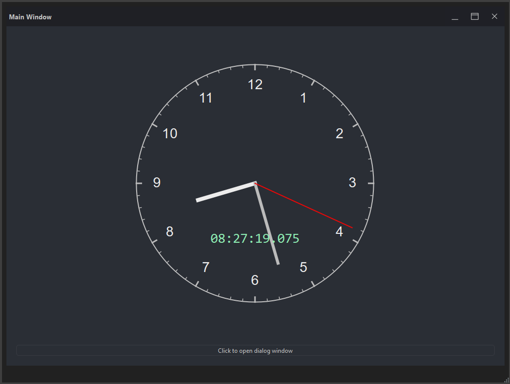
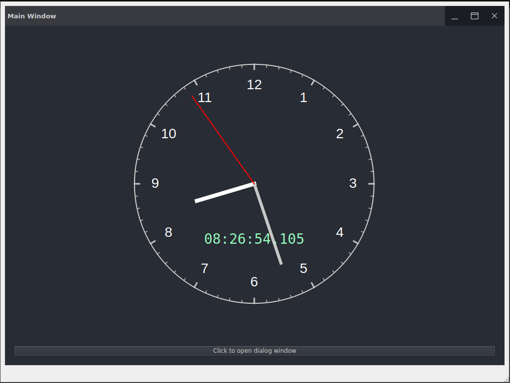

# Python Standalone GUI template

### Executable files do download for Windows and Linux:

<table>
  <tr>
    <th style="text-align: center;">Windows (click on image):</th>
    <th style="width: 100px;"></th>
    <th style="text-align: center;">Linux (click on image):</th>
  </tr>
  <tr>
    <td align="center">
      <a href="https://github.com/DariuszMak/python-standalone-gui-template/releases/download/0.15.0/GUI_client.exe">
        
      </a>
    </td>
    <td></td>
    <td align="center">
      <a href="https://github.com/DariuszMak/python-standalone-gui-template/releases/download/0.15.0/GUI_client">
        
      </a>
    </td>
  </tr>
</table>

## Requirements

- [UV](https://github.com/astral-sh/uv) package manager
- [Docker Desktop](https://www.docker.com/products/docker-desktop)


## Local development (Windows PowerShell):

You can also use VSCode `settings.json` and `launch.json` files to run the project (choose interpreter created by UV).

## Fast native Windows development:

```commandline
deactivate ; 
clear ; 

$ports = 8000, 8001, 8002

foreach ($port in $ports) {
    $conns = Get-NetTCPConnection -LocalPort $port -ErrorAction SilentlyContinue
    if ($conns) {
        $conns | Select-Object -ExpandProperty OwningProcess -Unique |
            Where-Object { $_ -gt 0 } |
            ForEach-Object {
                Write-Host "Port $port is used by PID $_. Killing..."
                Stop-Process -Id $_ -Force -ErrorAction SilentlyContinue
            }
    } else {
        Write-Host "No process is using port $port."
    }
}

uv self update ; 
uv cache clean ; 

git reset --hard HEAD ; 
git clean -x -d -f ; 

uv python install 3.11 ; 
uv python pin 3.11 ; 
uv sync --dev --no-cache ; 
uv lock ; 

########## STATIC ANALYSIS & TESTS

.venv\Scripts\Activate.ps1 ; 

Get-Content dev.env | ForEach-Object { if ($_ -match '^\s*([^=]+?)\s*=\s*"?([^"]*)"?') { [System.Environment]::SetEnvironmentVariable($matches[1], $matches[2], [System.EnvironmentVariableTarget]::Process) } else { Write-Warning "Invalid entry: '$_'" } } ; 

uv run python src\gui_setup.py ; 
uv run python src\node_setup.py ; 

.\scripts\format_and_lint.ps1 ; 
.\src\ui\react_ui\frontend\frontend_format_and_lint.ps1 ; 

.\src\ui\react_ui\frontend\frontend_test.ps1 ; 
uv run pytest tests/ --cov=src -vv ; 

########## RUN APPLICATION LOCALLY

Start-Process uv -ArgumentList "run", "python", "src\main.py" ; 
Start-Sleep -Seconds 20 ; 
Start-Process "http://127.0.0.1:8000/openapi.json" ; 
Start-Process "http://127.0.0.1:8000/redoc" ; 
Start-Process "http://127.0.0.1:8000/docs" ; 
Start-Process "http://127.0.0.1:8001" ; 
Start-Process "http://127.0.0.1:8002" ; 

newman run collections\Python_GUI_API.postman_collection.json --environment collections\environments_API\API_Windows.postman_environment.json ; 
newman run collections\Python_GUI_UI.postman_collection.json --environment collections\environments_UI\Panel_UI_Dev_Windows.postman_environment.json ; 
newman run collections\Python_GUI_UI.postman_collection.json --environment collections\environments_UI\React_UI_Dev_Windows.postman_environment.json ; 
```

## Thorough setup from scratch for Windows and Linux enviroment:

```commandline
deactivate ; 
clear ; 

$ports = 8000, 8001, 8002, 8003, 8004, 8005

foreach ($port in $ports) {
    $conns = Get-NetTCPConnection -LocalPort $port -ErrorAction SilentlyContinue
    if ($conns) {
        $conns | Select-Object -ExpandProperty OwningProcess -Unique |
            Where-Object { $_ -gt 0 } |
            ForEach-Object {
                Write-Host "Port $port is used by PID $_. Killing..."
                Stop-Process -Id $_ -Force -ErrorAction SilentlyContinue
            }
    } else {
        Write-Host "No process is using port $port."
    }
}

uv self update ; 
uv cache clean ; 

git reset --hard HEAD ; 
git clean -x -d -f ; 

uv python install 3.11 ; 
uv python pin 3.11 ; 
uv sync --dev --no-cache ; 
uv lock ; 

docker system df ; 
docker stop $(docker ps -a -q) ; 
docker rm -f $(docker ps -a -q) ; 
docker system prune --volumes -a -f ; 
docker system df ; 

docker-compose run --build app ; 

.venv\Scripts\Activate.ps1 ; 
$env:PYTHONPATH="." ; 

.\scripts\format_and_lint.ps1 ; 
.\src\ui\react_ui\frontend\frontend_format_and_lint.ps1 ; 

.\src\ui\react_ui\frontend\frontend_test.ps1 ; 
uv run pytest tests/ --cov=src -vv ;
uv sync --no-dev --locked --no-cache ; 
uv run pyinstaller --clean .\scripts\standalone_build_windows.spec ; 
cp -r -fo .\dist\* .\releases\windows\ ; 
rm -r -fo .\dist, .\build ; 

docker-compose run app sh -c "dos2unix thorough.env" ; 
docker-compose run app sh -c "uv sync --dev --locked --no-cache && uv run pytest tests/ --cov=src" ; 
docker-compose run --rm --remove-orphans app sh -c "uv sync --dev --locked --no-cache && uv run pyinstaller --clean ./scripts/standalone_build_linux.spec && cp -r dist/* releases/linux/" ; 
rm -r -fo .\dist, .\build ; 

########## RUN APPLICATIONS LOCALLY

Get-Content thorough.env | ForEach-Object { if ($_ -match '^\s*([^=]+?)\s*=\s*"?([^"]*)"?') { [System.Environment]::SetEnvironmentVariable($matches[1], $matches[2], [System.EnvironmentVariableTarget]::Process) } else { Write-Warning "Invalid entry: '$_'" } } ; 

Start-Process .\releases\windows\GUI_client.exe ; 
Start-Sleep -Seconds 25 ; 
Start-Process "http://127.0.0.1:8000/openapi.json" ; 
Start-Process "http://127.0.0.1:8000/redoc" ; 
Start-Process "http://127.0.0.1:8000/docs" ; 
Start-Process "http://127.0.0.1:8001" ; 
Start-Process "http://127.0.0.1:8002" ; 
newman run collections\Python_GUI_API.postman_collection.json --environment collections\environments_API\API_Windows.postman_environment.json ; 
newman run collections\Python_GUI_UI.postman_collection.json --environment collections\environments_UI\Panel_UI_Windows.postman_environment.json ; 
newman run collections\Python_GUI_UI.postman_collection.json --environment collections\environments_UI\React_UI_Windows.postman_environment.json ; 

#####

Start-Process wsl -ArgumentList @(
    'bash', '-c',
    'export DISPLAY=$(grep nameserver /etc/resolv.conf | awk "{print \$2}"):0 && \
     export QT_QPA_PLATFORM=wayland && \
     set -a && source thorough.env && set +a && \
     export API_HOST=$LINUX_API_HOST && \
     export API_PORT=$LINUX_API_PORT && \
     export PANEL_HOST=$LINUX_PANEL_HOST && \
     export PANEL_PORT=$LINUX_PANEL_PORT && \
     export REACT_HOST=$LINUX_REACT_HOST && \
     export REACT_PORT=$LINUX_REACT_PORT && \
     ./releases/linux/GUI_client'
)
Start-Sleep -Seconds 25 ; 
Start-Process "http://127.0.0.1:8003/openapi.json" ; 
Start-Process "http://127.0.0.1:8003/redoc" ; 
Start-Process "http://127.0.0.1:8003/docs" ; 
Start-Process "http://127.0.0.1:8004" ; 
Start-Process "http://127.0.0.1:8005" ; 
newman run collections\Python_GUI_API.postman_collection.json --environment collections\environments_API\API_Linux.postman_environment.json ; 
newman run collections\Python_GUI_UI.postman_collection.json --environment collections\environments_UI\Panel_UI_Linux.postman_environment.json ; 
newman run collections\Python_GUI_UI.postman_collection.json --environment collections\environments_UI\React_UI_Linux.postman_environment.json ; 
uv sync --dev --locked --no-cache ; 
```

## Edit `ui` forms with QT Designer:

```commandline
uv run pyside6-designer src\ui\pyside_ui\forms\main_window.ui ; 
uv run pyside6-designer src\ui\pyside_ui\forms\warning_dialog.ui ; 
```

### GUI files specification

<mark>.qrc</mark> - resources file edited in QT Designer

<mark>.ui</mark> - QT Designer form

<mark>ui_*.py</mark> - QT Designer generated tools
