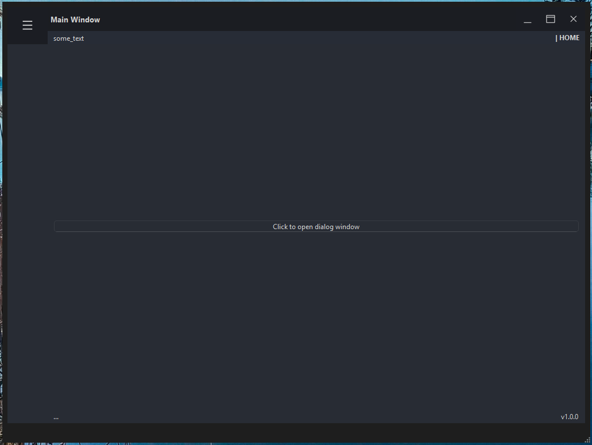

## Table of Contents

- [Python Standalone GUI template](#python-standalone-gui-template)
  - [Executable files do download for Windows and Linux](#executable-files-do-download-for-windows-and-linux)
  - [Requirements](#requirements)
  - [Local development (Windows PowerShell)](#local-development-windows-powershell)
  - [Fast native Windows development](#fast-native-windows-development)
  - [Thorough setup from scratch for Windows and Linux enviroment](#thorough-setup-from-scratch-for-windows-and-linux-enviroment)
  - [Particular code snippets](#particular-code-snippets)
    - [Install Python 3.11](#install-python-311)
    - [Run the application (compile mocks) from Docker](#run-the-application-compile-mocks-from-docker)
    - [Setup local environment and install dependencies](#setup-local-environment-and-install-dependencies)
    - [Docker should compile ui files manually](#docker-should-compile-ui-files-manually)
    - [Running application natively](#running-application-natively)
    - [Running executable application via PyInstaller](#running-executable-application-via-pyinstaller)
  - [Run tests](#run-tests)
  - [Edit ui forms with QT Designer](#edit-ui-forms-with-qt-designer)
  - [Code linting](#code-linting)
  - [Code autoformat](#code-autoformat)
  - [Running Docker container service](#running-docker-container-service)
  - [GUI files specification](#gui-files-specification)

---

# Python Standalone GUI template

### Executable files do download for Windows and Linux:

<table>
  <tr>
    <th style="text-align: center;">Windows (click on image):</th>
    <th style="width: 100px;"></th>
    <th style="text-align: center;">Linux (click on image):</th>
  </tr>
  <tr>
    <td align="center">
      <a href="https://github.com/DariuszMak/python-standalone-gui-template/releases/download/0.11.0/GUI_client.exe">
        
      </a>
    </td>
    <td></td>
    <td align="center">
      <a href="https://github.com/DariuszMak/python-standalone-gui-template/releases/download/0.11.0/GUI_client">
        
      </a>
    </td>
  </tr>
</table>

## Requirements

- [UV](https://github.com/astral-sh/uv) package manager
- [Docker Desktop](https://www.docker.com/products/docker-desktop)


## Local development (Windows PowerShell):

You can also use VSCode `settings.json` and `launch.json` files to run the project (choose interpreter created by UV).


## Environment Variables:

* `API_PORT` = `8001` or `8002`
* `API_HOST` = `127.0.0.1` 

## Fast native Windows development:

```commandline
deactivate ; 
clear ; 

$ports = 8000, 8001, 8005

foreach ($port in $ports) {
    $conn = Get-NetTCPConnection -LocalPort $port -ErrorAction SilentlyContinue
    if ($conn) {
        $pid = $conn.OwningProcess
        Write-Host "Port $port is used by PID $pid. Killing..."
        Stop-Process -Id $pid -Force
    } else {
        Write-Host "No process is using port $port."
    }
}

uv self update ; 
uv cache clean ; 

git reset --hard HEAD ; 
git clean -x -d -f ; 

uv python install 3.11 ; 
uv python pin 3.11 ; 
uv sync --dev --no-cache ; 
uv lock ; 

########## STATIC ANALYSIS & TESTS

.venv\Scripts\Activate.ps1 ; 
$env:PYTHONPATH="." ; 

uv run python src\gui_setup.py ; 

.\scripts\format_and_lint.ps1 ; 

uv run pytest test/ --cov=src -vv ; 

########## RUN APPLICATION LOCALLY

$env:API_PORT="8001" ; 
$env:API_HOST="127.0.0.1" ; 
$env:PANEL_PORT="8000" ; 
$env:PANEL_HOST="127.0.0.1" ; 
Start-Process uv -ArgumentList "run", "python", "src\main.py" ; 
Start-Sleep -Seconds 15 ; 
Start-Process "http://127.0.0.1:8001/schema/redoc" ; 
Start-Process "http://127.0.0.1:8001/schema/swagger" ; 
Start-Process "http://127.0.0.1:8000" ; 

$env:VITE_API_BASE="http://127.0.0.1:8000" ; 
$env:REACT_PORT="8005"

cd .\src\ui\react_ui\frontend\

# npm create vite@latest . # framework: react, typescript: yes
npm install

# create .env

npm run build
# output do ../static
cp -r dist/* ../static/

cd ../../../../

Start-Process uv -ArgumentList "run", "python", "src\ui\react_ui\app.py" ; 
Start-Sleep -Seconds 15 ; 
Start-Process "http://127.0.0.1:8005"

newman run collections\Python_GUI_API.postman_collection.json --environment collections\environments_API\API_Windows.postman_environment.json --bail ; 
newman run collections\Python_GUI_UI.postman_collection.json --environment collections\environments_UI\UI_Native_Windows.postman_environment.json --bail ; 
```

## Thorough setup from scratch for Windows and Linux enviroment:

```commandline
deactivate ; 
clear ; 

$ports = 8000, 8001, 8002

foreach ($port in $ports) {
    $conn = Get-NetTCPConnection -LocalPort $port -ErrorAction SilentlyContinue
    if ($conn) {
        $pid = $conn.OwningProcess
        Write-Host "Port $port is used by PID $pid. Killing..."
        Stop-Process -Id $pid -Force
    } else {
        Write-Host "No process is using port $port."
    }
}

uv self update ; 
uv cache clean ; 

git reset --hard HEAD ; 
git clean -x -d -f ; 

uv python install 3.11 ; 
uv python pin 3.11 ; 
uv sync --dev --no-cache ; 
uv lock ; 

docker system df ; 
docker stop $(docker ps -a -q) ; 
docker rm -f $(docker ps -a -q) ; 
docker system prune --volumes -a -f ; 
docker system df ; 

docker-compose run --build app ; 

.venv\Scripts\Activate.ps1 ; 
$env:PYTHONPATH="." ; 

.\scripts\format_and_lint.ps1 ; 

uv run pytest test/ --cov=src -vv ; 
docker-compose run app sh -c "uv sync --dev --locked --no-cache && uv run pytest test/ --cov=src" ; 

uv sync --no-dev --locked --no-cache ; 

docker-compose run --rm --remove-orphans app sh -c "uv sync --dev --locked --no-cache && uv run pyinstaller --clean ./scripts/standalone_build_linux.spec && cp -r dist/* linux_distribution/" ; 

rm -r -fo .\dist, .\build ; 

uv run pyinstaller --clean .\scripts\standalone_build_windows.spec ; 
cp -r -fo .\dist\* .\windows_distribution\ ; 

rm -r -fo .\dist, .\build ; 

########## RUN APPLICATIONS LOCALLY

$env:API_HOST="127.0.0.1" ; 
$env:API_PORT="8001" ; 
$env:PANEL_PORT="8003" ; 
$env:PANEL_HOST="127.0.0.1" ; 
Start-Process .\windows_distribution\GUI_client.exe ; 
Start-Sleep -Seconds 20 ; 
Start-Process "http://127.0.0.1:8001/schema/redoc" ; 
Start-Process "http://127.0.0.1:8001/schema/swagger" ; 
Start-Process "http://127.0.0.1:8003" ; 
newman run collections\Python_GUI_API.postman_collection.json --environment collections\environments_API\API_Windows.postman_environment.json --bail ; 
newman run collections\Python_GUI_UI.postman_collection.json --environment collections\environments_UI\UI_Windows.postman_environment.json --bail ; 

#####

Start-Process wsl -ArgumentList @(
    'bash', '-c',
    'export DISPLAY=$(grep nameserver /etc/resolv.conf | awk "{print \$2}"):0 && \
     export QT_QPA_PLATFORM=wayland && \
     export API_HOST=127.0.0.1 && \
     export API_PORT=8002 && \
     export PANEL_HOST=127.0.0.1 && \
     export PANEL_PORT=8004 && \
     ./linux_distribution/GUI_client'
)
Start-Sleep -Seconds 20 ; 
Start-Process "http://127.0.0.1:8002/schema/redoc" ; 
Start-Process "http://127.0.0.1:8002/schema/swagger" ; 
Start-Process "http://127.0.0.1:8004" ; 
newman run collections\Python_GUI_API.postman_collection.json --environment collections\environments_API\API_Linux.postman_environment.json --bail ; 
newman run collections\Python_GUI_UI.postman_collection.json --environment collections\environments_UI\UI_Linux.postman_environment.json --bail ; 
uv sync --dev --locked --no-cache ; 
```


## Particular code snippets

Make sure, that everything is committed or stashed and (optionally):

```commandline
git reset --hard HEAD ; 
git clean -x -d -f ; 
```

#### Install Python 3.11:

```commandline
uv python install 3.11 ; 
uv python pin 3.11 ; 
```

##### Run the application (compile mocks) from Docker

```commandline
docker system df ; 
docker stop $(docker ps -a -q) ; 
docker rm $(docker ps -a -q) ; 
docker system prune -a ; 
docker system df ; 

docker-compose run --build app ; 
```

##### Setup local environment and install dependencies

```commandline 
uv self update ; 
uv cache clean ; 
uv python pin 3.11 ; 
uv sync --dev --no-cache ; 
uv lock ; 
```

##### Docker should compile ```ui``` files, but as an alternative you can do it manually

```commandline
.venv\Scripts\Activate.ps1 ; 
$env:PYTHONPATH="." ; 

uv run python src\gui_setup.py ; 
```

### Running application natively

```commandline
.venv\Scripts\Activate.ps1 ; 
$env:PYTHONPATH="." ; 

uv run python src\main.py ; 
```

### Running executable application via PyInstaller (generate UI forms before !!!)

In order to generate executable application, run:
```commandline
.venv\Scripts\Activate.ps1 ; 
$env:PYTHONPATH="." ; 

uv run pyinstaller --clean .\scripts\standalone_build_windows.spec ; 
```


## Run tests:

```commandline
uv run pytest test/ -vv ; 
```

Run tests with coverage report:

```commandline
uv run pytest test/ --cov=. -vv ; 
```

Run tests in Docker:
```commandline
docker-compose run app sh -c "uv sync --dev --locked --no-cache  && uv run pytest test/ --cov=src -vv" ; 
```

Run Newman tests from saved collection (run application before execution):
```commandline
newman run collections\Python_GUI_API.postman_collection.json ; 
```


## Edit `ui` forms with QT Designer:

```commandline
uv run pyqt6-tools designer src\ui\pyside_ui\forms\main_window.ui ; 
uv run pyqt6-tools designer src\ui\pyside_ui\forms\warning_dialog.ui ; 
```


## Code linting

```commandline
.venv\Scripts\Activate.ps1 ; 
$env:PYTHONPATH="." ; 

clear ; 

uv run pip-audit ; 
uv run ruff check test src --exclude 'moc_.*\.py|files_rc\.py' ; 
uv run ruff format --check test src --exclude 'moc_.*\.py|files_rc\.py' ; 

uv run mypy --strict test src --exclude 'moc_.*\.py|files_rc\.py' ; 

# uv run mypy --explicit-package-bases test src --exclude 'moc_.*\.py|files_rc\.py' ; 
# uv run mypy --explicit-package-bases --check-untyped-defs test src --exclude 'moc_.*\.py|files_rc\.py' ; 
# uv run mypy --strict test src ; 
```


## Code autoformat

```commandline
.venv\Scripts\Activate.ps1 ; 
$env:PYTHONPATH="." ; 

clear ; 

uv run ruff format test src --exclude 'moc_.*\.py|files_rc\.py' ; 

uv run ruff check --fix test src --exclude 'moc_.*\.py|files_rc\.py' ; 
uv run ruff check --fix --unsafe-fixes test src --exclude 'moc_.*\.py|files_rc\.py' ; 
uv run ruff check --fix --select I test src --exclude 'moc_.*\.py|files_rc\.py' ; 
```

## Running Docker container service

##### Build and run
```commandline
docker-compose run --build app ; 
```

## GUI files specification

<mark>.qrc</mark> - resources file edited in QT Designer

<mark>.ui</mark> - QT Designer form

<mark>ui_*.py</mark> - QT Designer generated tools
