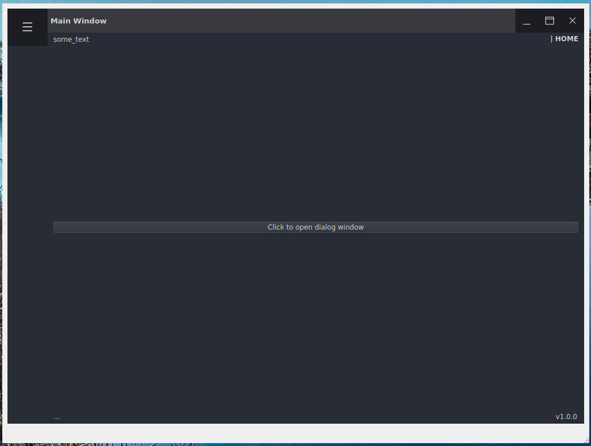

# Python Standalone GUI template

### Executable files do download for Windows and Linux:

<table>
  <tr>
    <th style="text-align: center;">Windows (click on image):</th>
    <th style="width: 100px;"></th>
    <th style="text-align: center;">Linux (click on image):</th>
  </tr>
  <tr>
    <td align="center">
      <a href="https://github.com/DariuszMak/python-standalone-gui-template/releases/download/0.7.0/GUI_client.exe">
        
      </a>
    </td>
    <td></td>
    <td align="center">
      <a href="https://github.com/DariuszMak/python-standalone-gui-template/releases/download/0.7.0/GUI_client">
        
      </a>
    </td>
  </tr>
</table>

## Requirements

- [UV](https://github.com/astral-sh/uv) package manager
- [Docker Desktop](https://www.docker.com/products/docker-desktop)


## Local development (Windows PowerShell):

You can also use VSCode `settings.json` and `launch.json` files to run the project (choose interpreter created by UV).

## Fast native Windows development:

```commandline
deactivate ; 
clear ; 

taskkill /PID (Get-NetTCPConnection -LocalPort 8000).OwningProcess /F
taskkill /PID (Get-NetTCPConnection -LocalPort 8001).OwningProcess /F

git reset --hard HEAD ; 
git clean -x -d -f ; 

uv python install 3.11 ; 
uv python pin 3.11 ; 
uv sync --dev --no-cache ; 
uv lock ; 

##### STATIC ANALYSIS & TESTS

$env:PYTHONPATH="." ; 
.venv\Scripts\Activate.ps1 ; 

.\scripts\format_and_lint.ps1 ; 

pytest test/ --cov=. -vv ; 

##### RUN APPLICATION LOCALLY

$env:API_PORT="8000"
$env:API_HOST="127.0.0.1"
uv run python src\gui_setup.py ; 
Start-Process src\main.py
Start-Sleep -Seconds 12 ; 
Start-Process "http://127.0.0.1:8000/schema/redoc" ; 
Start-Process "http://127.0.0.1:8000/schema/swagger" ; 
newman run collections\Python_GUI.postman_collection.json --environment collections\Windows.postman_environment.json --bail
```


## Thorough setup from scratch for Windows and Linux enviroment:

```commandline
deactivate ; 
clear ; 

taskkill /PID (Get-NetTCPConnection -LocalPort 8000).OwningProcess /F


git reset --hard HEAD ; 
git clean -x -d -f ; 


uv python install 3.11 ; 
uv python pin 3.11 ; 
uv sync --dev --no-cache ; 
uv lock ; 


docker system df ; 
docker stop $(docker ps -a -q) ; 
docker rm -f $(docker ps -a -q) ; 
docker system prune --volumes -a -f ; 
docker system df ; 

docker-compose run --build app ; 


$env:PYTHONPATH="." ; 
.venv\Scripts\Activate.ps1 ; 

.\scripts\format_and_lint.ps1 ; 

pytest test/ --cov=. -vv ; 
docker-compose run app sh -c "uv sync --dev --locked --no-cache && uv run pytest test/ --cov=." ; 

uv sync --no-dev --locked --no-cache ; 


docker-compose run --rm --remove-orphans app sh -c "uv sync --dev --locked --no-cache && uv run pyinstaller --clean ./scripts/standalone_build_linux.spec && cp -r dist/* linux_distribution/"

uv run pyinstaller --clean .\scripts\standalone_build_windows.spec ; 


##### RUN APPLICATIONS LOCALLY

$env:API_PORT="8000"
$env:API_HOST="127.0.0.1"
Start-Process .\dist\GUI_client.exe
Start-Sleep -Seconds 12 ; 
Start-Process "http://127.0.0.1:8000/schema/redoc" ; 
Start-Process "http://127.0.0.1:8000/schema/swagger" ; 
newman run collections\Python_GUI.postman_collection.json --environment collections\Windows.postman_environment.json --bail


Start-Process wsl -ArgumentList @(
    'bash', '-c',
    'export DISPLAY=$(grep nameserver /etc/resolv.conf | awk "{print \$2}"):0 && \
     export QT_QPA_PLATFORM=wayland && \
     export API_PORT=8001 && \
     export API_HOST=127.0.0.1 && \
     ./linux_distribution/GUI_client'
)
Start-Sleep -Seconds 20 ; 
Start-Process "http://127.0.0.1:8001/schema/redoc" ; 
Start-Process "http://127.0.0.1:8001/schema/swagger" ; 
newman run collections\Python_GUI.postman_collection.json --environment collections\Linux.postman_environment.json --bail


uv sync --dev --locked --no-cache ; 
```


## Particular code snippets

Make sure, that everything is committed or stashed and (optionally):

```commandline
git reset --hard HEAD ; 
git clean -x -d -f ; 
```

#### Install Python 3.11:

```commandline
uv python install 3.11 ; 
uv python pin 3.11 ; 
```

##### Run the application (compile mocks) from Docker

```commandline
docker system df ; 
docker stop $(docker ps -a -q) ; 
docker rm $(docker ps -a -q) ; 
docker system prune -a ; 
docker system df ; 

docker-compose run --build app ; 
```

##### Setup local environment and install dependencies

```commandline 
uv python pin 3.11 ; 
uv sync --dev --no-cache ; 
uv lock ; 
```

##### Docker should compile ```ui``` files, but as an alternative you can do it manually

```commandline
$env:PYTHONPATH="." ; 
.venv\Scripts\Activate.ps1 ; 

uv run python src\gui_setup.py ; 
```

### Running application natively

```commandline
$env:PYTHONPATH="." ; 
.venv\Scripts\Activate.ps1 ; 

uv run python src\main.py ; 
```

### Running executable application via PyInstaller (generate UI forms before !!!)

In order to generate executable application, run:
```commandline
$env:PYTHONPATH="." ; 
.venv\Scripts\Activate.ps1 ; 

uv run pyinstaller --clean .\scripts\standalone_build_windows.spec ; 
```


## Run tests:

```commandline
uv run pytest test/ -vv ; 
```

Run tests with coverage report:

```commandline
pytest test/ --cov=. -vv ; 
```

Run tests in Docker:
```commandline
docker-compose run app sh -c "uv sync --dev --locked --no-cache  && uv run pytest test/ --cov=. -vv" ; 
```

Run Newman tests from saved collection (run application before execution):
```commandline
newman run collections\Python_GUI.postman_collection.json ; 
```


## Edit `ui` forms with QT Designer:

```commandline
uv run pyqt6-tools designer src\ui\forms\main_window.ui ;
uv run pyqt6-tools designer src\ui\forms\warning_dialog.ui ;
```


## Code linting

```commandline
$env:PYTHONPATH="." ; 
.venv\Scripts\Activate.ps1 ; 

clear ; 

uv run pip-audit ;  
uv run ruff check test\ src\ --exclude 'moc_.*\.py|files_rc\.py' ; 
uv run ruff format --check test\ src\ --exclude 'moc_.*\.py|files_rc\.py' ; 
uv run mypy --explicit-package-bases test\ src\ --exclude 'moc_.*\.py|files_rc\.py' ; 
# uv run mypy --explicit-package-bases --check-untyped-defs . ; 
```


## Code autoformat

```commandline
$env:PYTHONPATH="." ; 
.venv\Scripts\Activate.ps1 ; 

clear ; 

uv run ruff format test\ src\ --exclude 'moc_.*\.py|files_rc\.py' ; 

uv run ruff check --fix test\ src\ --exclude 'moc_.*\.py|files_rc\.py' ; 
uv run ruff check --fix --unsafe-fixes test\ src\ --exclude 'moc_.*\.py|files_rc\.py' ; 
uv run ruff check --fix --select I test\ src\ --exclude 'moc_.*\.py|files_rc\.py' ; 
```

## Running Docker container service

##### Build and run
```commandline
docker-compose run --build app ; 
```

## GUI files specification

<mark>.qrc</mark> - resources file edited in QT Designer

<mark>.ui</mark> - QT Designer form

<mark>ui_*.py</mark> - QT Designer generated tools
